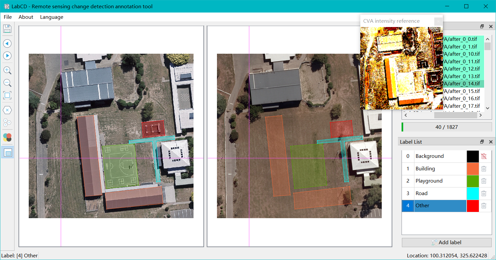

# Summary

In recent years, with the development of deep learning, more and more data needs to be annotated. There are many annotation tools we can choosed, like [labelme](https://github.com/wkentaro/labelme) or [labelimg](https://github.com/heartexlabs/labelImg). But they only support traditional computer vision (CV) tasks, like classification, segmentation and detection, etc. Not in remote sensing change detection in the field of  geoscience.

LabCD is an annotation tool. It was designed with reference to [EISeg](https://github.com/PaddlePaddle/PaddleSeg/tree/release/2.7/EISeg) [@hao2022eiseg, @hao2021edgeflow], but it is mainly used for remote sensing change detection. LabCD provides left-right synchronization of the canvas, and support GeoTiff split and IO with coordinate reference systems (CRS) by [GDAL](https://gdal.org/). Above all, LabCD is a convenient and fast data annotation tool for remote sensing professional fields.

# Audience

LabCD is intended for students who engaged in remote sensing change detection and deep learning research. This will help them  annotation data quickly. And they will have more time to train their AI models based on some geoscience deep learning tools, like [PaddleRS](https://github.com/PaddlePaddle/PaddleRS).

# Functionality

LabCD is written in C++ and has a graphical user interface (GUI) developed in [Qt6](https://www.qt.io/product/qt6). A screenshot of LabCD is provided in Figure 1. This screenshot shows the capabilities of LabCD in a single image. The main features of LabCD are:

- Support GeoTiff split and IO with CRS

- Support left-right synchronization of the canvas and cross

- Provide change vector analysis (CVA) reference

- Friendly label and file/process management

Figure 1: A screenshot of LabCD. Two images are being annotated.

# Tutorials

Some documentation and videos are available for using LabCD, including:

- [Shortcut list](https://github.com/geoyee/LabCD/wiki/%E5%BF%AB%E6%8D%B7%E9%94%AE%E5%88%97%E8%A1%A8)

- [bilibili video: Qt remote sensing change detection annotation software](https://www.bilibili.com/video/BV11j411T7up?t=23.2)

# Acknowledgements

I thank [Lin Manhui](https://github.com/Bobholamovic) for helping me with some C++ programming in this project.

# References