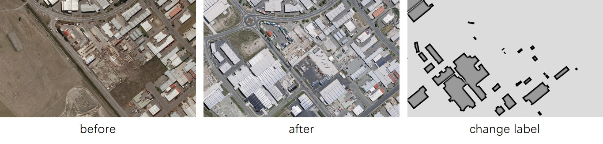

# Introduction

Remote sensing change detection is a way to obtain dynamic changes of various surface information by comparing and processing the information reflected by multiple static remote sensing images (include satellite and unmanned aerial vehicle (UAV) image) [@2003Principles]. The working objects of remote sensing change detection are the images of the same region in different periods.

It is usually used  evaluating natural disaster, change detection of the land use / cover, change detection of architectural areas, and etc. An area where a 6.3-magnitude earthquake has occurred in February 2011 and rebuilt in the following years [@2018Fully]  in Figure 1.

Capturing and annotating remote sensing images is the first step in this work, and LabCD is an annotation tool for remote sensing change detection.

# Statement of need

In recent years, with the development of deep learning, more and more data needs to be annotated. There are many annotation tools we can choosed, like [labelme](https://github.com/wkentaro/labelme) [@2008LabelMe] or [labelimg](https://github.com/heartexlabs/labelImg) [@tzutalin2015labelimg]. They support multiple categories of annotation tasks, such as image classification, segmentation or detection, but can't work in remote sensing change detection. So in this field, usually we use [ArcGIS](https://www.arcgis.com/index.html), [QGIS](https://github.com/qgis/QGIS) [@QGIS_software] or ENVI, and etc. They are great software about remote sensing / geographic information science (GIS), but as an annotation tools, they are big and complex. By the way, they are not efficient for annotation for remote sensing change detection.

For example, ArcGIS and QGIS can't create two synchronized windows, so it is necessary to switch back and forth between the displays of two images and use shapefiles for annotation. Finally, the shapefile needs to be rasterized into an image. Of course, ENVI can be used to open synchronized interfaces for change detection annotation, either with its own software or IDL. However, it is larger than 3GB and requires a license.

LabCD is developed based on C++17. It has a graphical user interface (GUI) developed in [Qt6](https://www.qt.io/product/qt6) and depends on [OpenCV](https://github.com/opencv/opencv) [@opencv_library], [JsonCpp](https://github.com/open-source-parsers/jsoncpp), [GDAL](https://gdal.org/) [@gdal] and [Eigen](https://gitlab.com/libeigen/eigen) [@eigenweb] and it provides project files including Visual Studio and Qt Creator, as well as CMakeLists files. It was designed with reference to [EISeg](https://github.com/PaddlePaddle/PaddleSeg/tree/release/2.7/EISeg) [@hao2022eiseg; @hao2021edgeflow], but it is mainly used for remote sensing change detection. LabCD provides left-right synchronization of the canvas, and support GeoTiff split and IO with coordinate reference systems (CRS). Above all, LabCD is a convenient and fast data annotation tool for remote sensing professional fields.

|          | Open source / Free | Simple | GeoTiff IO | Dual-window synchronization |
| :------: | :----------------: | :----: | :--------: | :-------------------------: |
| labelme  |         √          |   √    |            |                             |
| labelimg |         √          |   √    |            |                             |
|  ArcGIS  |                    |        |     √      |                             |
|   QGIS   |         √          |        |     √      |                             |
|   ENVI   |                    |        |     √      |              √              |
|  LabCD   |         √          |   √    |     √      |              √              |

# Audience

LabCD is intended for students and researchers who engaged in remote sensing change detection and deep learning research. This tool will help them  annotation data quickly. And they will have more time to train their AI models based on some geoscience deep learning tools, like [PaddleRS](https://github.com/PaddlePaddle/PaddleRS).

# Functionality

LabCD has complete functions on annotation for remote sensing change detection. A screenshot of LabCD is provided in Figure 2. This screenshot shows the capabilities of LabCD in a single image. The main features of LabCD are:

- Support GeoTiff split / merge and IO with CRS.

- Support left-right synchronization of the canvas and cross, it is more intuitive than roll-up canva.

- Provide change vector analysis (CVA) [@jensen1999remote] reference.

- Automatically calculate optimum index factor (OIF) [@chavez1988improved] during the first loading for multispectral data.

- Friendly label and file / process management.

# Tutorials

Some documentation and videos are available for using LabCD, including:

- [Download and usage](https://github.com/geoyee/LabCD/blob/develop/docs/Download_and_usage_en.md)

- [Keyboard shortcuts](https://github.com/geoyee/LabCD/blob/develop/docs/Keyboard_shortcuts_en.md)

- [Usage tutorial](https://github.com/geoyee/LabCD/blob/develop/docs/Usage_tutorial_en.md)

# Acknowledgements

I thank [Lin Manhui](https://github.com/Bobholamovic) and [Zhao Junchao](https://github.com/junchao-loongson) for helping me with some C++ programming in this project.

# References
